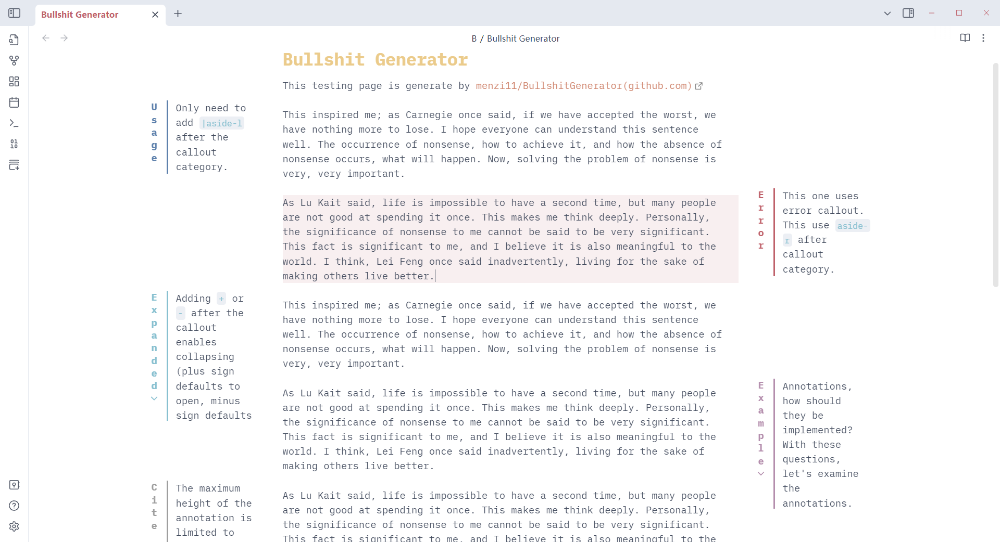
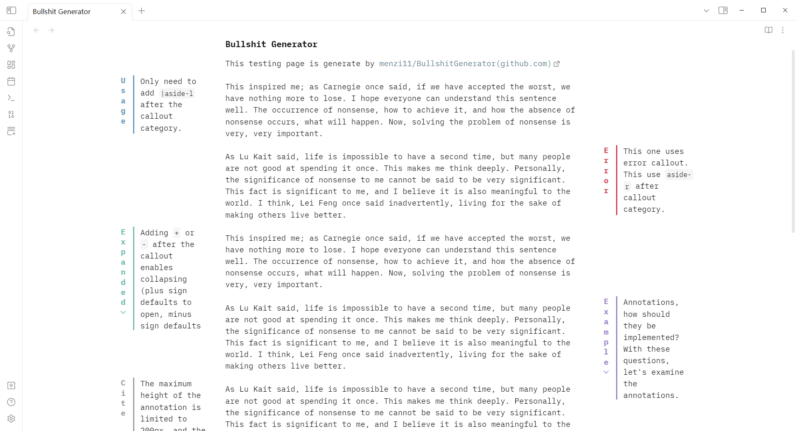
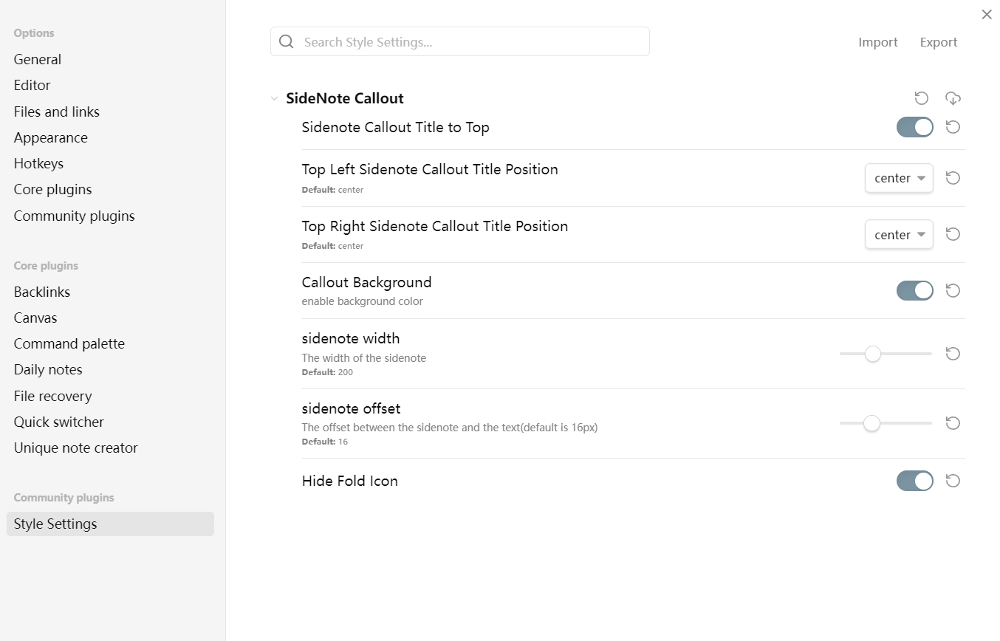
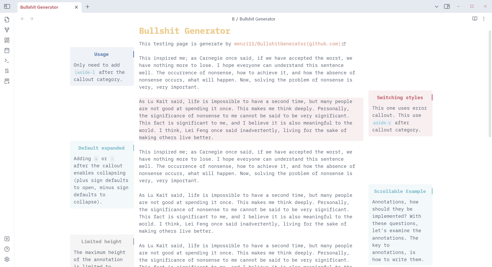
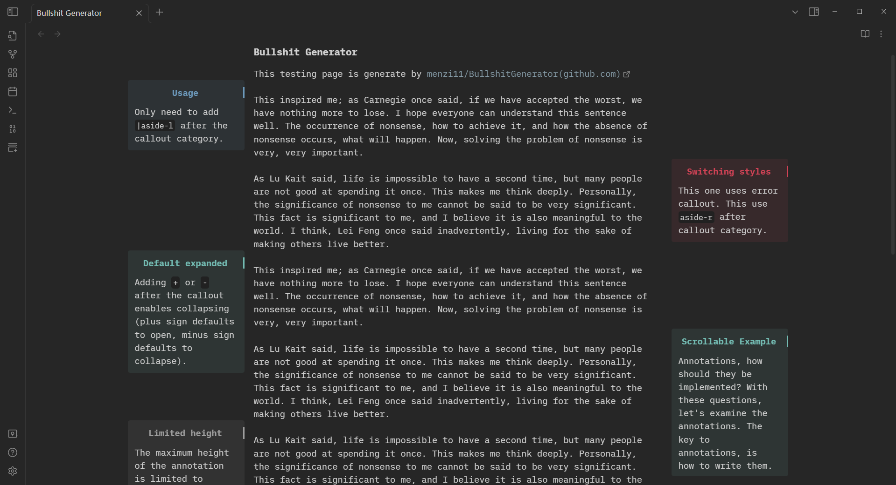

# Obsidian 样式 - 用 Callout 实现的边注（注释）

使用 obsidian 自带的 callout 语法，不污染笔记，且用法非常简单。



Theme：[Obsidian Nord](https://github.com/insanum/obsidian_nord)



Theme: [minimal](https://github.com/kepano/obsidian-minimal)

> 展示文本由 [menzi11/BullshitGenerator(github.com)](https://github.com/menzi11/BullshitGenerator) 生成

## 特点

- 由 callout 渲染得到，使用简单，方便迁移。
- 阅读模式和实时渲染模式均适用。
- 适配了多个主题

## 使用方法

添加好 css 后，在正文中直接用边注的 callout 即可（如何添加 css 可以看这篇：[[Obsidian的CSS代码片段]]）

如果想要左边的边注，可以这样写

```
> [!NOTE|aside-l] 左侧注释
> 注释内容
```

如果想要右边的边注，可以这样写

```
> [!NOTE|aside-r] 右侧注释
> 注释内容
```

如果想要边注可折叠，可以用 callout 的折叠语法

```
> [!NOTE|aside-l]+ 默认展开的注释
> 注释内容
```

```
> [!NOTE|aside-r]- 默认折叠的注释
> 注释内容
```

边注基于 callout 实现，因此可以像 callout 一样使用不同的样式

```
> [!ERROR|aside-l] ERROR 样式
> 还可以用别的callout，例如important, cite 等
```

## Style Settings

本 css 可以配合 style settings 插件使用，可以调整注释的样式



例如：
- 开启背景
- 边注标题置于顶部
- 隐藏折叠图标



Theme：[Obsidian Nord](https://github.com/insanum/obsidian_nord)



Theme: [minimal](https://github.com/kepano/obsidian-minimal)

## 不足

- 当屏幕宽度不足时无法显示，例如手机屏幕以及分屏时
- 边注的标题在侧边时不宜过长
- 暂未导出 PDF 的样式（doing）
- 边注的位置目前只能固定在侧边，还未支持上下调整，后续可能会增加该功能（doing）

## 参考

感谢两位大佬的css带来的思路

- https://discord.com/channels/686053708261228577/702656734631821413/1155147566615367680
- https://discord.com/channels/686053708261228577/702656734631821413/1073456247849881610